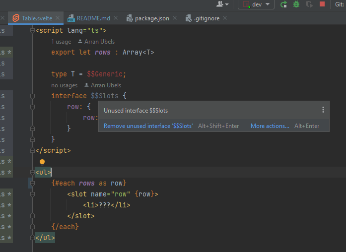
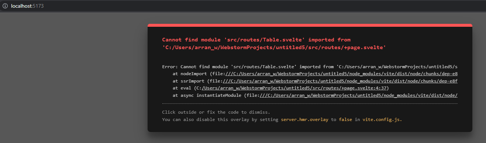
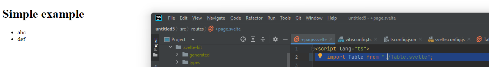

This is for a coule of idea issues:

# Issue 1: `$$Generic` isn't supported


It should be used to set the type on the slot here:


I expect it to be `string`

# Issue 2: `$$Slots`



This seems partially supported, since I have a matching 
slot definition below this should be considered in use.

# Issue 3: Default import paths

Default import path on a brand new project generated using the "getting started guide" is "wrong".
JetBrains even knows it's wrong:



Should be: (relative)

```
    import Table from "./Table.svelte";
```

Given there are no path alias defined.



